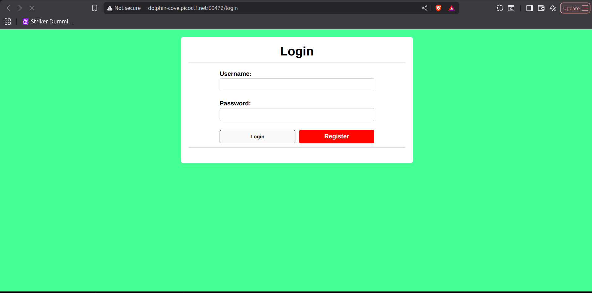
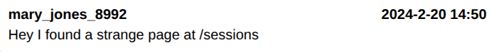
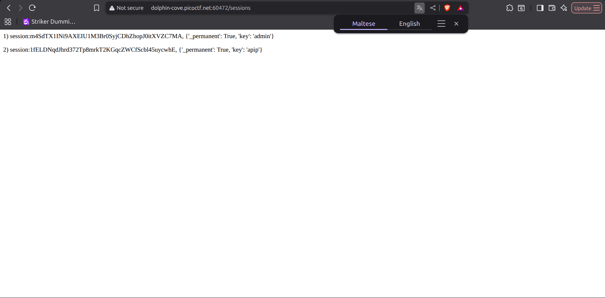
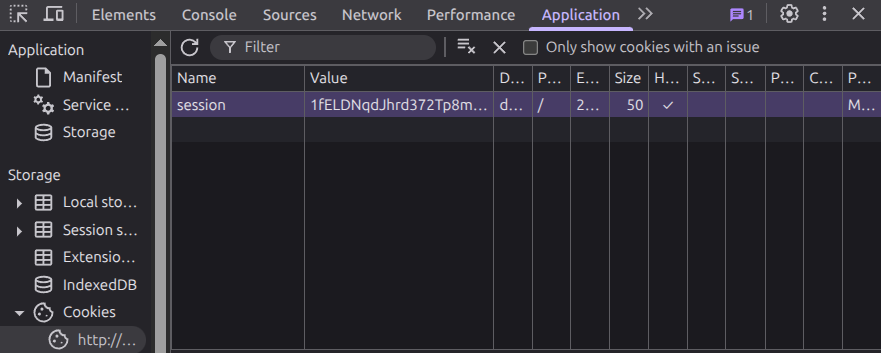
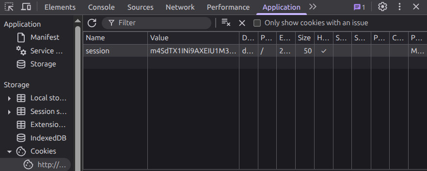
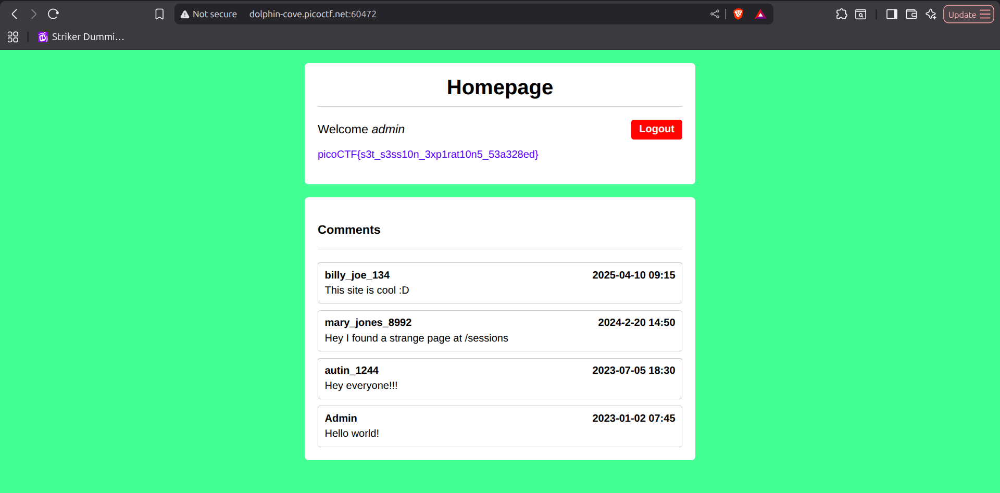

# Old Sessions — picoCTF 2026

| Informasi | Detail |
|---|---|
| Event | picoCTF 2026 |
| Challenge | Old Sessions |
| Kategori | Web Exploitation |
| Poin | 100 |
| Difficulty | Easy |

## Deskripsi Challenge

Challenge ini membahas pentingnya kontrol timeout pada sesi pengguna. Jika sebuah aplikasi web tidak mengatur masa kedaluwarsa sesi dengan benar, maka sesi yang sudah pernah login dapat tetap aktif dalam waktu yang sangat lama atau bahkan tidak pernah berakhir.

Skenario yang diberikan adalah sebuah platform media sosial lama yang masih dalam tahap pengembangan. Developer-nya menyebutkan bahwa ia tidak suka harus login berkali-kali, sehingga membuat sistem autentikasi dengan konsep “sekali login, tidak perlu logout lagi”. Hal ini mengindikasikan adanya kemungkinan konfigurasi session expiration yang lemah.

Deskripsi challenge:

```text
Proper session timeout controls are critical for securing user accounts. If a user logs in on a public or shared computer but doesn’t explicitly log out (instead simply closing the browser tab), and session expiration dates are misconfigured, the session may remain active indefinitely.

This then allows an attacker using the same browser later to access the user’s account without needing credentials, exploiting the fact that sessions never expire and remain authenticated.

Your friend tells you to check out a new social media platform he built a few years ago. Although its still under development, he said the site is almost complete. He also mentioned that he hates constantly logging into sites, and so has made his page that 'once you login, you never have to log-out again'!
```

Hint yang diberikan juga mengarah ke inspeksi cookie pada browser:

```text
1. Do you know how to use the web inspector?
2. Where are cookies stored?
```

> 📸 **Placeholder gambar:** Screenshot halaman challenge/landing page yang menampilkan form register atau login.
> Simpan sebagai: `images/01-homepage-login.png`
>
> 

## Reconnaissance / Analisis Awal

Pertama, saya membuka website challenge. Pada halaman awal tersedia fitur registrasi dan login. Saya membuat akun baru, kemudian login menggunakan akun tersebut.

> 📸 **Placeholder gambar:** Screenshot halaman setelah login sebagai user biasa, misalnya dashboard/feed aplikasi.
> Simpan sebagai: `images/02-user-dashboard.png`
>
> 

Setelah berhasil login, saya melihat beberapa chat/posting di dalam aplikasi. Di salah satu chat terdapat pesan dari user berikut:

```text
mary_jones_8992
2024-2-20 14:50
Hey I found a strange page at /sessions
```

> 📸 **Placeholder gambar:** Screenshot chat/post yang berisi petunjuk `Hey I found a strange page at /sessions`.
> Simpan sebagai: `images/03-chat-hint-sessions.png`
>
> 

Pesan tersebut menjadi petunjuk penting karena menyebutkan endpoint tersembunyi:

```text
/sessions
```

Saya kemudian membuka endpoint tersebut secara langsung melalui browser. Halaman tersebut menampilkan daftar session yang tersimpan, termasuk session milik admin dan session milik akun saya.

Output yang ditemukan:

```text
1) session:Z0rpf3gFJn1SGVBwSdQSsbnDhuJOtsVexAadrS0qjMU, {'_permanent': True, 'key': 'admin'}

2) session:EqUgE5_899JasRtzzEfo6RhpcE-DJMU4onIH0cMq5gg, {'_permanent': True, 'key': 'apip'}
```

> 📸 **Placeholder gambar:** Screenshot halaman `/sessions` yang menampilkan daftar session aktif, termasuk session admin dan user biasa.
> Simpan sebagai: `images/04-sessions-endpoint.png`
>
> 

Dari output tersebut terlihat bahwa aplikasi menyimpan session aktif beserta informasi user yang terasosiasi dengan session tersebut. Session pertama memiliki nilai `key` sebagai `admin`, sedangkan session kedua adalah session milik akun saya sendiri.

## Vulnerability Identified

Vulnerability utama pada challenge ini adalah **broken session management** akibat session yang tidak memiliki kontrol kedaluwarsa yang aman dan informasi session yang terekspos melalui endpoint `/sessions`.

Masalah keamanan yang ditemukan:

1. **Session tidak kedaluwarsa dengan benar**  
   Field berikut menunjukkan bahwa session dibuat permanen:

   ```text
   '_permanent': True
   ```

   Jika session permanent tidak dikombinasikan dengan expiration time yang aman, maka session dapat tetap valid terlalu lama.

2. **Endpoint `/sessions` membocorkan session aktif**  
   Endpoint tersebut menampilkan session token milik user lain, termasuk admin. Ini sangat berbahaya karena session token adalah kredensial autentikasi sementara.

3. **Aplikasi mempercayai cookie session tanpa validasi tambahan**  
   Dengan mengganti nilai cookie `session` di browser menjadi token milik admin, aplikasi langsung menganggap request berasal dari admin.

Secara konsep, celah ini memungkinkan **session hijacking**. Karena attacker mendapatkan token session admin, attacker dapat meniru identitas admin tanpa mengetahui username atau password admin.

## Exploitation Steps

### 1. Registrasi akun baru

Saya membuka website challenge, lalu membuat akun baru melalui form registrasi.

Contoh akun yang digunakan:

```text
username: apip
password: bebas
```

### 2. Login ke aplikasi

Setelah registrasi, saya login menggunakan akun yang baru dibuat.

```text
Login sebagai user biasa: apip
```

### 3. Mencari informasi dari chat

Di dalam aplikasi terdapat chat yang memberikan petunjuk endpoint tersembunyi:

```text
Hey I found a strange page at /sessions
```

Endpoint yang ditemukan:

```text
/sessions
```

### 4. Membuka endpoint `/sessions`

Saya membuka endpoint `/sessions` pada browser. Endpoint tersebut menampilkan daftar session aktif.

Output:

```text
1) session:Z0rpf3gFJn1SGVBwSdQSsbnDhuJOtsVexAadrS0qjMU, {'_permanent': True, 'key': 'admin'}

2) session:EqUgE5_899JasRtzzEfo6RhpcE-DJMU4onIH0cMq5gg, {'_permanent': True, 'key': 'apip'}
```

Dari output ini, session admin dapat diidentifikasi sebagai berikut:

```text
Z0rpf3gFJn1SGVBwSdQSsbnDhuJOtsVexAadrS0qjMU
```

Session milik akun saya:

```text
EqUgE5_899JasRtzzEfo6RhpcE-DJMU4onIH0cMq5gg
```

### 5. Mengganti cookie session melalui DevTools

Selanjutnya saya membuka browser DevTools.

Langkahnya:

```text
Right Click → Inspect → Application → Cookies → pilih domain challenge
```

Pada bagian cookies, saya mencari cookie bernama:

```text
session
```

> 📸 **Placeholder gambar:** Screenshot DevTools tab Application/Storage yang menampilkan cookie `session` sebelum diganti.
> Simpan sebagai: `images/05-cookie-before.png`
>
> 

Nilai cookie session milik akun saya kemudian diganti dengan session milik admin.

Sebelum diganti:

```text
session=EqUgE5_899JasRtzzEfo6RhpcE-DJMU4onIH0cMq5gg
```

Sesudah diganti:

```text
session=Z0rpf3gFJn1SGVBwSdQSsbnDhuJOtsVexAadrS0qjMU
```

> 📸 **Placeholder gambar:** Screenshot DevTools setelah nilai cookie `session` diganti menjadi session milik admin.
> Simpan sebagai: `images/06-cookie-after-admin-session.png`
>
> 

### 6. Refresh halaman utama

Setelah cookie diganti, saya kembali ke halaman utama aplikasi dan melakukan refresh. Karena aplikasi menggunakan cookie `session` sebagai penentu identitas user, saya berhasil masuk sebagai admin.

Setelah berhasil mengambil alih session admin, flag ditampilkan pada halaman web.

> 📸 **Placeholder gambar:** Screenshot halaman utama setelah refresh yang menunjukkan akses sebagai admin dan flag muncul.
> Simpan sebagai: `images/07-flag-admin-page.png`
>
> 

## Flag

```text
picoCTF{s3t_s3ss10n_3xp1rat10n5_53a328ed}
```

## Lesson Learned

Session token harus diperlakukan seperti kredensial sensitif dan tidak boleh pernah terekspos ke user lain. Aplikasi web juga wajib menerapkan session expiration yang aman, invalidasi session saat logout, serta membatasi akses ke endpoint internal seperti `/sessions`.
